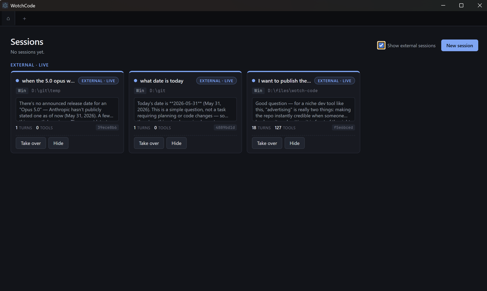
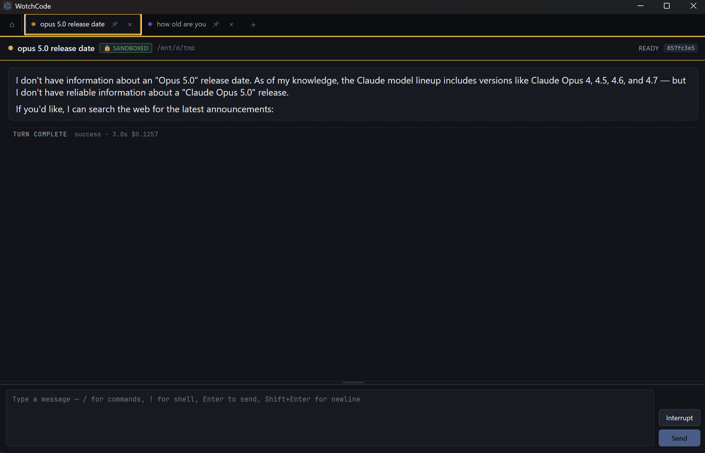
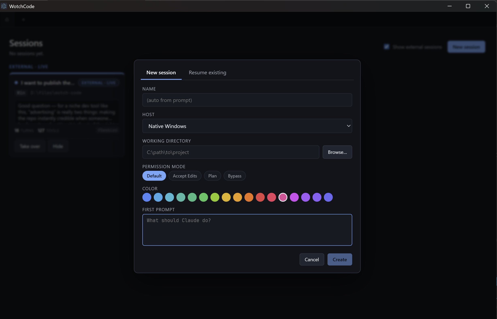
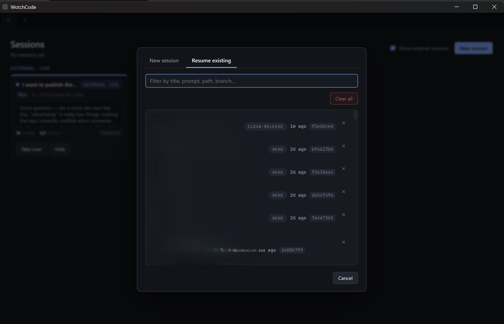

# WotchCode

A multi-session **Claude Code** orchestrator built on Electron + React. Run many
Claude Code sessions in parallel tabs, each in its own working directory and host
(native Windows or sandboxed WSL) — like a browser, but every tab is a full Claude
Code session with its own state, permission mode, and model.

> WotchCode turns Claude Code into a tabbed, multi-session desktop workspace. Get
> native modals for tool approvals and structured questions, a `/` command palette,
> a `!` shell prefix, and automatic discovery of Claude Code sessions already
> running in your terminals — with a one-click "Take Over".

## Features

- **Tabbed multi-session orchestration** — run multiple Claude Code sessions side
  by side, each with its own working directory, host, permission mode, and model.
- **Two execution hosts out of the box** — native Windows (fast, unsandboxed) and
  sandboxed WSL (bubblewrap isolation, sandbox-by-default).
- **External session tracking** — WotchCode watches `~/.claude/projects/` and
  surfaces Claude Code sessions you started in a terminal, live. Click **Take Over**
  to adopt one as a managed tab.
- **Native approval & question modals** — Claude's permission requests and the
  SDK's structured `AskUserQuestion` tool render as real Electron modals instead of
  terminal prompts.
- **`/` command palette** — SDK-provided commands (skills, plugin commands,
  built-ins) plus client-side extras (`/rename`, `/clear`, `/resume`).
- **`!` shell prefix** — run a shell command on the session's host; output shows in
  the UI only, leaving Claude's context untouched.

## Screenshots

**Dashboard — external sessions, tracked live.** Claude Code sessions started in
a terminal show up automatically; open them read-only or **Take Over** to adopt
one as a managed tab.



**A session in a sandboxed WSL tab.** The green `🔒 SANDBOXED` chip means tool
calls run inside bubblewrap; the input bar takes `/` commands and `!` shell lines.



**New session.** Pick a host, working directory, permission mode, model, and an
initial prompt.



**Resume existing.** Search and reopen any past Claude Code session.



## Requirements

- **Windows 10 / 11 (x64)**
- **Node.js 18+** on the Windows side (for `npm run dev` / `build`)
- **A working Claude Code login** — credentials and saved sessions live in
  `~/.claude/` and are read at runtime. Install and sign in with
  [Claude Code](https://docs.claude.com/en/docs/claude-code) first if you haven't.
- **WSL with a Linux distro** _(only if you want the sandboxed WSL host)_

## Project Setup

```powershell
npm install
npm run dev          # development
```

To produce a redistributable installer:

```powershell
npm run build:win    # → dist\wotch-code-<version>-setup.exe
```

The installer creates a Desktop and Start Menu shortcut named **WotchCode** and
registers a real uninstaller. `%APPDATA%\wotch-code\` is removed on uninstall;
`~/.claude/` (your Anthropic credentials and saved sessions) is preserved.

If `electron-builder` fails with _"Cannot create symbolic link"_ during the
`winCodeSign` step, enable **Settings → Privacy & security → For developers →
Developer Mode** and retry.

## Hosts

WotchCode runs each tab on a host. Two are available out of the box:

| Host           | What it is                                                                                               | Sandbox by default                             |
| -------------- | -------------------------------------------------------------------------------------------------------- | ---------------------------------------------- |
| Native Windows | Spawns the runner with Electron-as-Node, cwd is a Windows path                                           | No (the SDK sandbox is Linux/macOS-only)       |
| WSL            | Spawns the runner via `wsl.exe -d <default-distro> --exec node …`; cwd is translated to `/mnt/<drive>/…` | Yes — fail-loud if `bwrap`/`socat` are missing |

When sandbox is active, the session header shows a green `🔒 sandboxed` chip.
Tool calls run inside `bubblewrap`: filesystem writes outside the cwd fail with
`EROFS`, network is restricted, processes can't see the host.

## WSL Setup

These steps run **once**. After, every WSL tab Just Works.

### 1. Install WSL + a distro (skip if already installed)

```powershell
wsl --install -d Ubuntu
```

Reboot if prompted. Verify your default distro:

```powershell
wsl -l -v
```

The row prefixed with `*` is the default — that's the one WotchCode uses.

### 2. Install runtime dependencies inside the distro

```powershell
wsl -d Ubuntu -- sudo apt-get update
wsl -d Ubuntu -- sudo apt-get install -y nodejs npm bubblewrap socat
```

- `nodejs` — the WSL runner is plain `node`, must be on PATH.
- `bubblewrap` + `socat` — required by the SDK sandbox. Without them, sessions
  fail loudly at startup (this is intentional — you asked for sandbox-by-default).

### 3. Install the Linux SDK binary on the Windows side

The Claude Agent SDK ships a platform-specific native binary; on Windows only
the win32-x64 one is installed automatically. The WSL runner needs the linux-x64
one too. Run once from the project root:

```powershell
npm run prepare:wsl
```

This drops `@anthropic-ai/claude-agent-sdk-linux-x64` into `node_modules` so
the WSL-side runner can resolve it through the shared `/mnt/...` mount.

### 4. Verify

Restart WotchCode (probe runs at startup), open the new-tab modal — the host
dropdown should show **WSL - &lt;your distro&gt;** with no setup hint.
Create a tab pointed at any Windows folder (e.g. `D:\files\wotch-code`); the
session header should show the green sandbox chip.

If the host appears with a setup hint like _"node not found in Ubuntu"_ or
_"run npm run prepare:wsl"_, fix that before creating a session — clicking
Create surfaces the same hint as a blocking alert.

## Custom UI affordances

These are surfaced on top of the SDK's native flow:

- **`/` slash commands** — palette opens as you type; SDK-provided commands
  (skills, plugin commands, built-ins) are forwarded directly. A few extra are
  handled client-side: `/rename`, `/clear`, `/resume`.
- **`!` shell prefix** — runs the rest of the line as a shell command on the
  session's host (PowerShell on Windows, `bash -lc` inside WSL). Output
  appears as a terminal block visible _only_ in the UI; Claude's context is
  unchanged. Buffer caps at 256 KB.
- **AskUserQuestion modal** — the SDK's structured-question tool renders as a
  real modal with options, optional preview pane, free-text fallback, and
  per-question notes. Answers stream back to the model as the tool result.
- **Approval modal** — Claude's permission requests render as a modal showing
  the tool name, input, and any blocked-path / decision-reason context.
- **External sessions** — sessions started outside WotchCode (e.g. `claude` in a
  terminal) are detected by watching `~/.claude/projects/` and shown alongside
  your managed tabs. Open one read-only to follow along, or **Take Over** to stop
  the external process and resume it as a fully managed tab.

## Project Layout

```
src/
  main/             Electron main process
    hosts/          Per-host adapters (windows-host, wsl-host)
    session-manager.ts
    external-tracker.ts   Watches ~/.claude/projects for external sessions
  preload/          contextBridge → window.api
  renderer/         React UI
  runner/           Per-tab subprocess that owns one SDK query()
  shared/           IPC + protocol types
electron-builder.yml   Installer config
electron.vite.config.ts
```

## Recommended IDE Setup

[VSCode](https://code.visualstudio.com/) +
[ESLint](https://marketplace.visualstudio.com/items?itemName=dbaeumer.vscode-eslint) +
[Prettier](https://marketplace.visualstudio.com/items?itemName=esbenp.prettier-vscode).

## Contributing

Issues and pull requests are welcome. Before opening a PR, please run:

```powershell
npm run typecheck
npm run lint
```

## License

[MIT](./LICENSE) © Vadim Albarov
